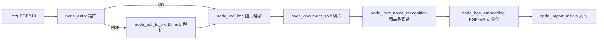
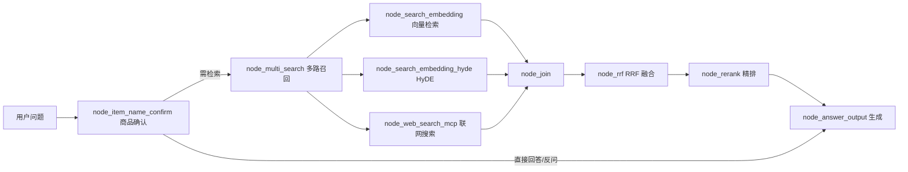

# 掌柜智库 · 知识库系统（Knowledge Base）

面向**商品手册 / 产品文档**的领域 **RAG（检索增强生成）知识库**。基于 **LangGraph** 编排「导入」与「查询」两条流水线，实现从 PDF/Markdown 文档解析、切片、向量化、入库，到多路召回、融合重排、问答生成的完整闭环。

- **导入链路**：PDF（MinerU 结构化解析）/ Markdown → 图片理解 → 切片 → 商品主体识别 → BGE-M3 向量化 → Milvus 入库
- **查询链路**：商品型号确认 → 向量检索 / HyDE / 联网搜索三路召回 → RRF 融合 → 精排重排 → 流式问答

---

## 核心特性

- **双流水线编排**：LangGraph 状态图，条件路由（PDF/MD）+ 并行 fan-out / join
- **混合向量检索**：BGE-M3 稠密（语义）+ 稀疏（关键词）双向量，Milvus 加权融合
- **多路召回 + RRF 融合**：向量检索 / HyDE（假设性答案检索）/ 联网搜索（MCP）三路并行，Reciprocal Rank Fusion 融合
- **精排重排**：qwen3-rerank 交叉编码打分 + 断崖检测动态截断 Top-K
- **商品主体识别**：LLM 自动识别商品/产品名，作为检索过滤元数据，避免跨商品误召回
- **图片理解**：多模态大模型生成图片摘要，上传 MinIO 并替换引用
- **流式问答**：SSE 流式输出，会话历史落 MongoDB
- **异步导入**：后台任务 + 进度轮询，幂等入库（先删后插 + flush）
- **效果评测**：RAGAS 评测脚本

---

## 系统架构

### 导入流水线



### 查询流水线



### 存储与模型

| 层 | 技术 | 用途 |
|---|---|---|
| 编排 | LangGraph | 两条流水线状态图 |
| 向量库 | Milvus | 稠密 + 稀疏混合检索（`kb_chunks` / `kb_item_names`） |
| 文档库 | MongoDB | 会话历史 |
| 对象存储 | MinIO | 原始文件 + 图片 |
| 嵌入 | BGE-M3（本地，CUDA） | 稠密 + 稀疏向量 |
| 重排 | qwen3-rerank（DashScope API） | 交叉编码精排 |
| 大模型 | Qwen 系列（DashScope API） | 文本生成 / 多模态 / 商品识别 |
| 文档解析 | MinerU（云 API） | PDF → Markdown |
| 评测 | RAGAS | 检索/生成质量评估 |

---

## 技术亮点

- **混合检索（Hybrid Search）**：BGE-M3 同时产出 1024 维稠密向量与词权重稀疏向量，Milvus 用 `WeightedRanker`（稠密 0.8 / 稀疏 0.2）加权融合，兼顾语义召回与关键词精确匹配，比单一稠密检索对型号、编号类查询召回更稳。
- **HyDE（Hypothetical Document Embedding）**：先让 LLM 基于问题生成"假设性答案"，再用「问题 + 假设答案」拼成的富语义文本去检索，缓解短查询与长文档之间的语义稀疏问题。
- **RRF 多路融合**：向量检索、HyDE、联网搜索三路结果用 Reciprocal Rank Fusion 按排名倒数融合，各路不依赖分数量纲，避免某一路分数过大"淹没"其它路。
- **商品主体识别 + 过滤**：导入时用 LLM 识别文档的商品名入库元数据；查询时先确认商品名、再对 Milvus 检索加 `item_name` 过滤表达式，从源头避免跨商品误召回。
- **断崖截断（Cliff Cutoff）**：精排后按相邻文档分数差（绝对差 + 相对差）检测"相关性断崖"，动态截断 Top-K，去掉低相关噪音再喂给生成，提升答案质量。
- **幂等导入 + 一致性**：按 `file_title` 先删后插实现重复导入幂等；`insert` 后立即 `flush`，保证导入完成即可被检索到。

---

## 技术栈

- **语言 / 包管理**：Python 3.12+ · `uv`
- **Web**：FastAPI + Uvicorn（SSE 流式）
- **编排**：LangGraph、LangChain
- **检索**：Milvus（`pymilvus[model]`）、BGE-M3（FlagEmbedding / transformers）
- **模型**：transformers、torch（CUDA）、dashscope、modelscope
- **存储**：pymongo、minio
- **测试**：pytest

---

## 目录结构

```
knowledge_base/
├── config/                 # 配置单例（dataclass + 环境变量）
│   ├── embedding_config.py # BGE-M3 嵌入配置
│   ├── lm_config.py        # LLM 配置
│   ├── milvus_config.py    # Milvus 配置
│   ├── mineru_config.py    # MinerU 配置
│   ├── minio_config.py     # MinIO 配置
│   ├── reranker_config.py  # 重排配置
│   └── bailian_mcp_config.py # 联网搜索 MCP 配置
├── processor/
│   ├── import_processor/   # 导入流水线（节点 + 状态 + 主图）
│   │   ├── main_graph.py   #   导入图定义
│   │   ├── base.py         #   节点基类（日志/异常/任务追踪）
│   │   ├── state.py        #   图状态
│   │   └── nodes/          #   entry / pdf_to_md / md_img / split / item_name / bge / milvus
│   └── query_processor/    # 查询流水线（节点 + 状态 + 主图）
│       ├── main_graph.py   #   查询图定义
│       ├── base.py         #   节点基类
│       ├── state.py        #   图状态
│       └── nodes/          #   item_name_confirm / search / hyde / web_search / rrf / rerank / answer
├── utils/                  # 公共工具（embedding / milvus / mongo / minio / llm / rerank / sse / task）
├── web/                    # FastAPI 服务层 + 前端页面
│   ├── api/
│   │   ├── import_service.py # 导入 API（端口 8000）
│   │   └── query_service.py  # 查询 API（端口 8001）
│   └── page/
│       ├── import.html     # 上传页
│       └── chat.html       # 对话页
├── eval/                   # RAGAS 评测（evaluate_ragas.py + 问答集）
├── tests/                  # pytest 单元测试
├── .env.example            # 环境变量模板
└── pyproject.toml          # 依赖与 uv 源配置
```

---

## 环境要求

- **Python** 3.12+
- **`uv`** 包管理器（[安装](https://docs.astral.sh/uv/)）
- **NVIDIA GPU + CUDA**（BGE-M3 本地嵌入默认 `cuda:0`；无 GPU 可改 `.env` 的 `BGE_DEVICE=cpu`，但会明显变慢）

### 外部服务（需先启动）

| 服务 | 默认地址 | 说明 |
|---|---|---|
| Milvus | `http://localhost:19530` | 向量库 |
| MongoDB | `mongodb://localhost:27017` | 会话历史 |
| MinIO | `localhost:9000` | 对象存储（默认 `minioadmin`/`minioadmin`） |

### 需要申请的密钥

| 密钥 | 用途 |
|---|---|
| `MINERU_API_TOKEN` | MinerU 云 API，PDF 解析（https://mineru.net） |
| `OPENAI_API_KEY` / `DASHSCOPE_API_KEY` | 阿里云 DashScope（LLM / VL / rerank / 联网搜索） |

> 只导入 Markdown、不做 PDF 解析时，可暂不配置 MinerU。

---

## 快速开始

### 1. 安装依赖

```bash
git clone <repo-url>
cd knowledge_base
uv sync
```

> `pyproject.toml` 已配置 `torch` 从 NVIDIA cu128 源安装。

### 2. 配置环境变量

```bash
cp .env.example .env   # Windows PowerShell: Copy-Item .env.example .env
```

编辑 `.env`，至少填好：`DASHSCOPE_API_KEY`、`BGE_M3_PATH`（本地模型路径）、`MINERU_API_TOKEN`（如需 PDF）、以及 Milvus / MongoDB / MinIO 地址。

### 3. 下载 BGE-M3 嵌入模型

```bash
uv run python -c "from modelscope import snapshot_download; snapshot_download('BAAI/bge-m3', cache_dir='D:/ai_models/modelscope_cache')"
```

> 路径需与 `.env` 中 `BGE_M3_PATH` 一致。

### 4. 启动外部服务

确保 Milvus、MongoDB、MinIO 已启动（可用 Docker 自行编排）。

### 5. 启动应用（两个服务分别起）

```bash
# 导入服务（端口 8000）
uv run python -m web.api.import_service

# 查询服务（端口 8001）
uv run python -m web.api.query_service
```

### 6. 访问

| 页面 | 地址 |
|---|---|
| 导入页 | http://127.0.0.1:8000/import.html |
| 对话页 | http://127.0.0.1:8001/chat.html |
| 接口文档 | http://127.0.0.1:8000/docs |

---

## API 接口

### 导入服务（8000）

| 方法 | 路径 | 说明 |
|---|---|---|
| POST | `/upload` | 多文件上传，返回 `task_ids` |
| GET | `/status/{task_id}` | 查询任务进度（status / done_list / running_list） |

### 查询服务（8001）

| 方法 | 路径 | 说明 |
|---|---|---|
| POST | `/query` | 问答（`query` / `session_id` / `is_stream`） |
| GET | `/stream/{session_id}` | SSE 流式结果 |
| GET | `/history/{session_id}` | 查询会话历史 |
| DELETE | `/history/{session_id}` | 清空会话历史 |
| GET | `/health` | 健康检查 |

---

## 测试

```bash
uv run pytest tests/ -v
```

单元测试覆盖：MD 导入 `md_content` 回写、Milvus insert 后 flush、联网搜索 MCP 优雅降级、rerank 的 None 兜底与异常处理、导入服务进度追踪等。

---

## 评测（RAGAS）

```bash
cd eval
uv run python evaluate_ragas.py
```

- `qa.csv`：评测问答集
- `qa_result.csv`：评测输出（由脚本生成，已 gitignore）

---

## 已知问题

- **联网搜索（MCP）需开通**：DashScope MCP WebSearch 服务需在百炼控制台开通，否则该路召回为空（已做优雅降级，不影响主链路，仅少一路外部召回）。
- **MinIO 需启动**：图片理解 / 文件存储依赖 MinIO，未启动时相关功能降级。
- **密钥安全**：`.env`、`eval/.env` 已加入 `.gitignore`，切勿提交真实密钥。
